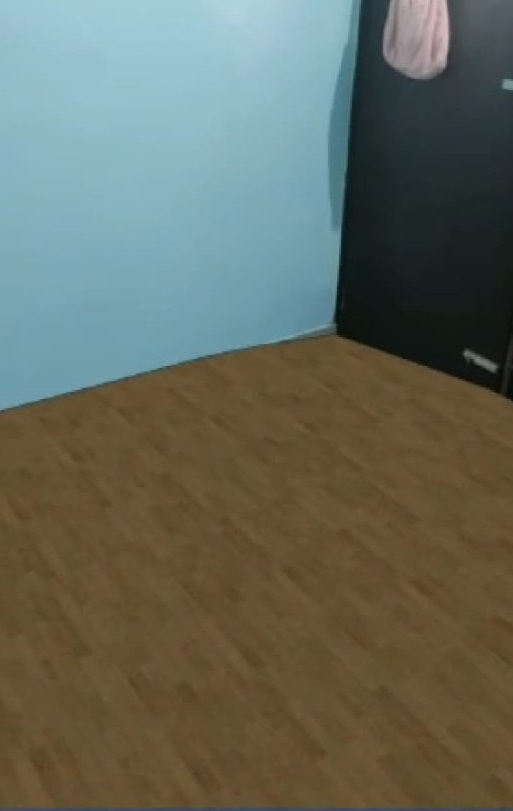

# Interiorismo_AR
An Interior decor AR app.
The app incorporates AR to help the user select from a collection of furniture and tiles and to see how the real selected object would look in the surroundings.
# Tech Stack
1. Unity3d
2. AR Core
3. C#
# Images
. . .
. . .
# Areas To Contribute
1. Have a more diverse range of furniture and other decor items.
2. Include a display card for the furniture items.
3.Have a smoother interface and better UI.
4. Better tile detection system.
5. Work upon the rotation and scaling of the objects.
# How to Contribute?
If you have found an issue that you can solve, follow these steps to create a pull request.
1. Fork this repository.
2. Make a new branch and give it a name related to your issue. (Make sure that the branch you are creating should be from main branch)
3. Use git checkout <branchname> to shift to that new branch and now work on it and add your files that will solve the issue.
4. Once you've added the files, do use the git add command, and commit the files.
5. Now push these files(in your branch).
6. Go to github's website and open the forked repo. 
7. Select the new branch that you created from the dropdown menu of branch.
8. Make a pull request and don't forget to mention the issue in the description of your pull request.
  
  Happy Contributing!
